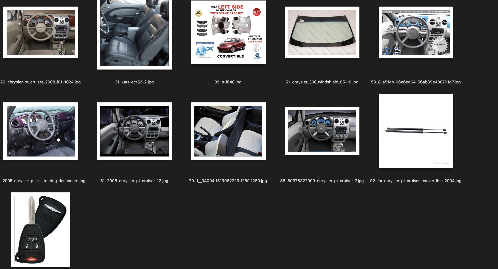
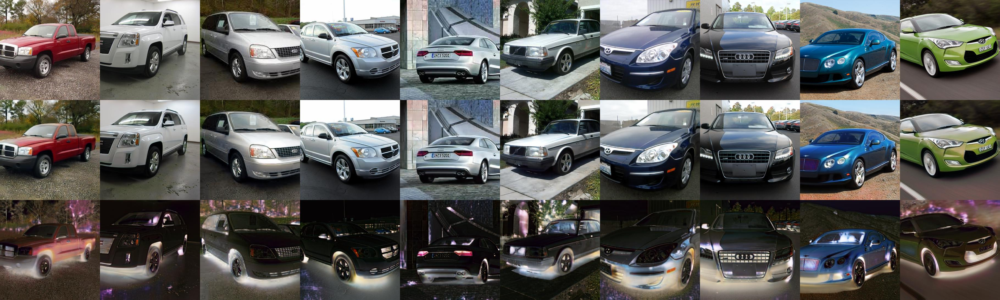
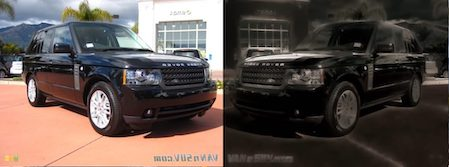

# GrabAIChallenge

This repository contains to run training and predictions for a modified Weakly Supervised Data Augmentation Network which achieves 96.18% validation accuracy: [See Better Before Looking Closer: Weakly Supervised Data Augmentation Network for Fine-Grained Visual Classification](https://arxiv.org/abs/1901.09891) using EfficientNet B3 as feature extractor [EfficientNet: Rethinking Model Scaling for Convolutional Neural Networks](https://arxiv.org/abs/1905.11946) 

I also explored using Segmentation and Style Transfer GAN augment images from day time to night time. For more information on code usage, please skip over to Usage section.


## Data Preparation

I used the stanford cars dataset sorted by classes folder at [https://www.kaggle.com/jutrera/stanford-car-dataset-by-classes-folder](https://www.kaggle.com/jutrera/stanford-car-dataset-by-classes-folder)

First I combined the provided train and test dataset and did a 75/25 train test split using rebuild_dataset.py to maximise the training data available

Train size: 12208    Test size: 3997

Duplicates have been removed using Gemini.

I added new data from Google Images using the script g_images_download.py

Some of these new images are irrelevant (car interiors or car parts). I cleaned around 25 image folders manually and fine-tuned a pretrained Xception to classify these new images as wanted or unwanted. We used this model to help us clean the rest of the data using predict_unwanted_images.py. This dataset is combined with the original 12208 training images and I will refer to it as 'New Data'. Some of the images classified as unwanted by this model are shown below:



The new data is also cleaned manually as there are some images misclassified by Google Images eg: convertible vs coupe, Dodge Challenger vs Dodge Charger SRT. I will refer to this dataset as 'New Data V2'.

I used the Imagenet Data Augmentation Policy from AutoAugment [Github](https://github.com/DeepVoltaire/AutoAugment) [Paper](https://arxiv.org/abs/1805.09501v1)

## Model

I first used a standard image classification method to obtain a baseline. I used Xception with [random erasing augmentation](https://github.com/yu4u/cutout-random-erasing), [AdaBound optimizer](https://github.com/titu1994/keras-adabound) and class weights. Adding new data seems to reduce validation accuracy as some of the images from Google Images come with advertisement words and graphics that may have confused the classifier (advertisment graphics for cheaper cars differ significantly compared to those for more expensive cars)

#### CNN Baseline Results

| Model Name                                                 | Training Accuracy | Validation Accuracy |
| ---------------------------------------------------------- | ----------------- | ------------------- |
| CNN Baseline: Xception, random cutout, adabound optimiser  | 98.11             | 93.66               |
| CNN Baseline New Data Classweights                         | 95.38             | 92.27               |
| CNN Baseline New Data V2 Classweights                      | 97.25             | 93.51               |
| CNN Baseline New Data V2 Classweights Increased Image Size | 98.36             | 93.30               |


I used the implementation of Weakly Supervised Data Augmentation (WSDAN) from [https://github.com/GuYuc/WS-DAN.PyTorch](https://github.com/GuYuc/WS-DAN.PyTorch). However, the original implementation seems to have performance issues as some users have [commented](https://github.com/GuYuc/WS-DAN.PyTorch/issues/1). Running the original implementation on my rebuilt dataset, I only managed to obtain 91.28% accuracy.


After reading through the paper and code in depth, I realised there were a few implementation errors. After fixing the errors, I managed to obtain 95.31% validation accuracy which is further increased to 95.97% using additional data from Google Images. Since the network uses attention cropping, the effect of advertisement words and graphics seems to be mitigated.  Switching the feature extractor to EfficientNetB3 from InceptionV3 and increasing the number of attention maps from 32 to 64 resulted in the final validation accuracy of 96.18%.

#### WS DAN Results

| Model Name                                                                    | Training Accuracy | Validation Accuracy |
| ----------------------------------------------------------------------------- | ----------------- | ------------------- |
| Original Implementation                                                       | 99.76             | 91.28               |
| Change (256, 256) crop size to original image size                            | 99.76             | 93.29               |
| Change LR schedule to reduce on plateau and remove double input preprocessing | 99.84             | 95.31               |
| New Data V2                                                                   | 99.95             | 95.97               |
| EfficientNetB3                                                                | 99.95             | 95.99               |
| **EfficientNetB3, 64 attention maps (epoch 34)**                              | **99.95**         | **96.18**           |
| EfficientNetB4, 64 attention maps                                             | 99.89             | 94.23               |


## Style Transfer GAN

As the training dataset consists of only day time images, I explored using [Unsupervised Image-to-Image Translation](https://github.com/mingyuliutw/UNIT) (UNIT) and [Fast Photo Style Transfer](https://github.com/NVIDIA/FastPhotoStyle) to convert day time images to night time. I tried collecting night time images from Google Images, but there are only a few relevant images per car brand so I went out to film some of my own night time data. In total we had only 366 night time images however and the results should be better should more data be available. For Fast Photo Style Transfer we first used [DeepLabV3 with Xception Backbone](https://github.com/tensorflow/models/tree/master/research/deeplab) to obtain segmentation maps as the results without segmentation maps are quite bad. As the code is licensed under a non-commercial license, I won't be able to include it here.

Here are some of the results from UNIT:




Here are some of the results from FastPhotoStyle using segmentation maps:




## Super Resolution
The image size I used for WSDAN is 512 by 512, if the input image is significantly smaller than this size, accuracy will be affected. To test the effect of small image size, I downsampled each image in the validation set such that the smallest side of the image is 128 pixels.

To mitigate this, I decided to use a script to run super resolution on test images if the image size is below a certain threshold area (I set as 128*256). I converted the super resolution model from [DBPN Pytorch](https://github.com/alterzero/DBPN-Pytorch). The converted keras model [can be downloaded here](https://drive.google.com/open?id=1mpCAw6vojqly2bZinlU8Ddt3BGMNjjFn)


#### Results
| Dataset                 | Accuracy |
| ----------------------- | -------- |
| Original Validation Set | 96.18    |


## Usage

### Requirements

Python 3.6

```
scikit-learn~=0.20.3 numpy~=1.16.4 pandas~=0.24.2 tqdm~=4.31.1
```


For CNN Baseline:

I used the tensorflow_p36 environment on AWS Linux

```
keras==2.2.4 keras-applications==1.0.7 keras-metrics==1.1.0 keras-preprocessing==1.0.9 tensorflow==1.13.1
```


For WS DAN

I used the pytorch_p36 environment on AWS Linux

```
pytorch==1.1.0 torchvision==0.2.2 scipy==1.2.1
```

EfficientNet needs to be installed by running

```bash
cd EfficientNet-PyTorch
python setup.py develop --no-deps
```

### Run Predictions

```
cd ws-dan
python wsdan_predict.py --data-dir path_to_images --ckpt-dir path_to_model_checkpoint --output-dir path_to_save_predictions
```

The best performing model EfficientNetB3 with 64 attention maps [can be downloaded here](https://drive.google.com/file/d/1fT20Xom6x_TDSCHsyh8pDYfHp4-6LjaO/view?usp=sharing)

Options:

  -j , --workers
    number of data loading workers (default: n_cpus)

  -b , --batch-size
    batch size (default: 32)

  --fn, --feature-net
    Name of base model. Accepted values are inception/ resnet152cbam/ efficientnetb3 (default: efficientnetb3)

  --gpu, --gpu-ids
    IDs of gpu(s) to use in inference, multiple gpus should be seperated with commas (default: 0)

  --de, --do-eval
    If labels are provided, set True to evaluate metrics (default: True)

  --csv, --csv-labels-path
    If eval mode is set, set to "folder" to read labels from folders with classnames. 
    Set to csv path to read labels from csv (default: folder)

  --csv-headings
    heading of image filepath and label columns in csv

  --dd, --data-dir
    directory to images to run evaluation/ prediction

  --cp, --ckpt-path
    Path to saved model checkpoint (default: ./checkpoints/model.pth)

  --od, --output-dir
    saving directory of extracted class probabilities csv file


### Run Training

```bash
cd ws-dan
python train_wsdan.py 
```

Options:
  -j , --workers
    number of data loading workers (default: 16)

  --gpu, --gpu-ids
    IDs of gpu(s) to use in inference, multiple gpus should be seperated with commas

  -v, --verbose
    show information for each <verbose> iterations (default: 0)

  -b, --batch-size
    batch size (default: 32)

  -e, --epochs
    number of epochs (default: 100)

  --lr, --learning-rate
    learning rate (default: 0.001)

  -m, --model
    model for feature extractor inception/resnetcbam/efficientnetb3 (default: efficientnetb3)

  -c, --ckpt
    path to checkpoint directory if resuming training (default: False)

  --dd, --data-dir
    path to directory containing folders named 'train' and 'test'

  --sd, --save-dir
    saving directory of .ckpt models (default: ./checkpoints/model)

  --sf, --save-freq
    saving frequency of .ckpt models (default: 1)
